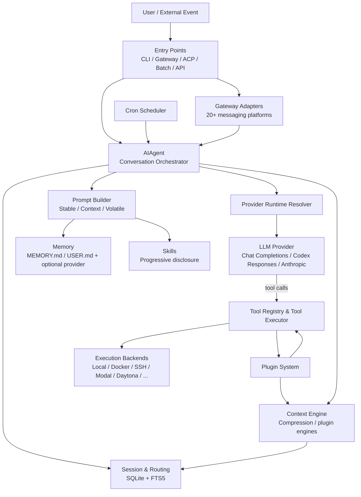
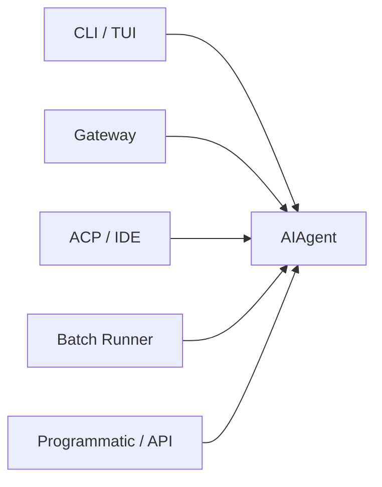
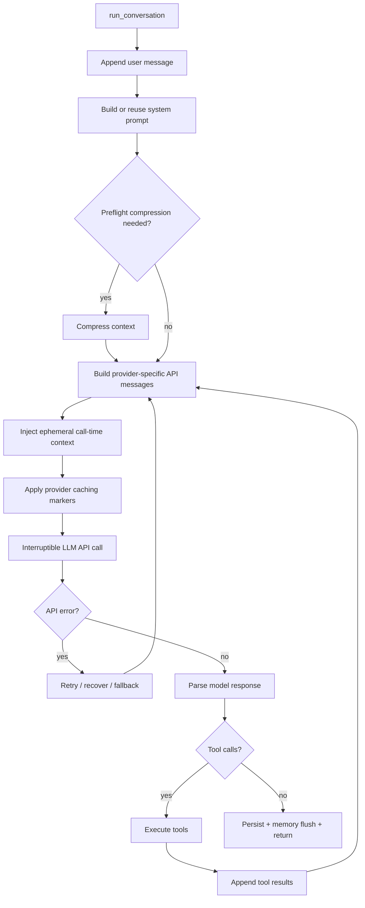
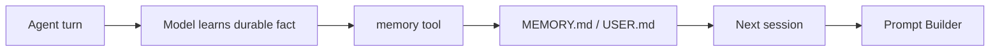
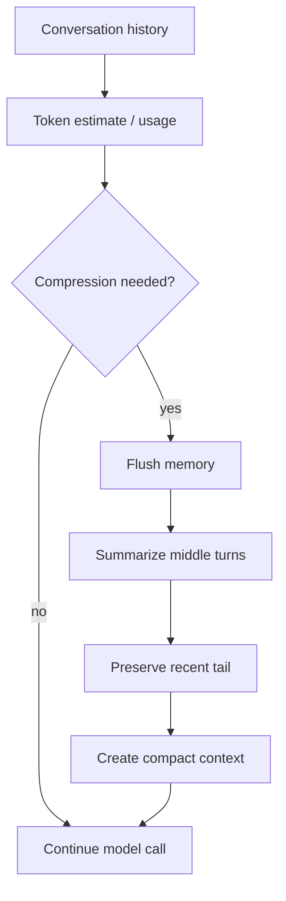
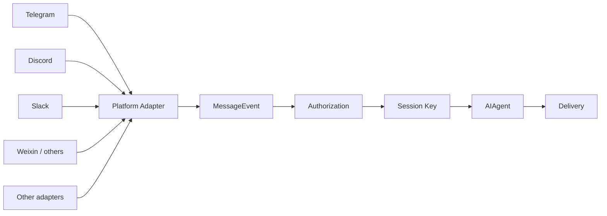
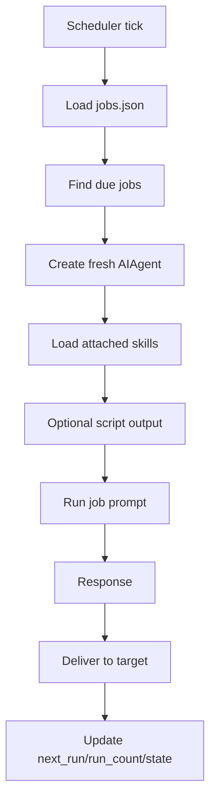
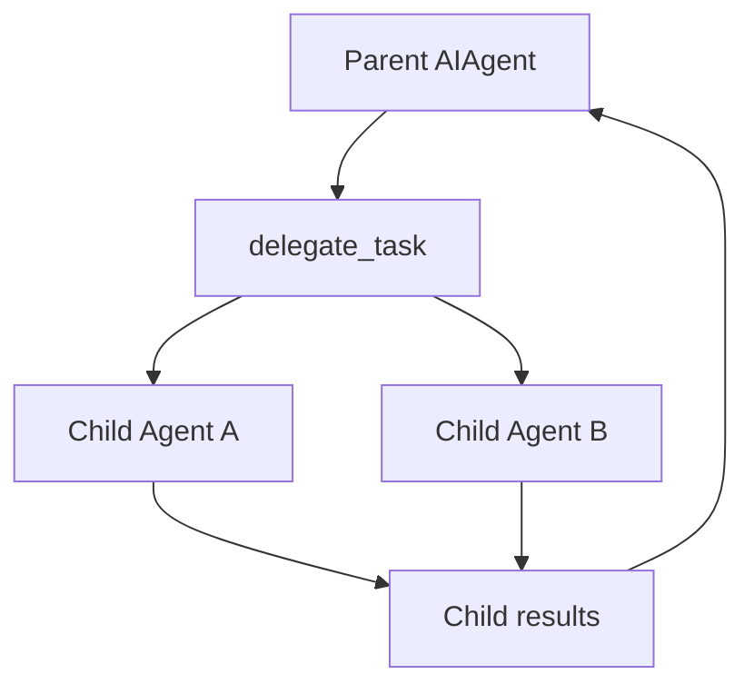
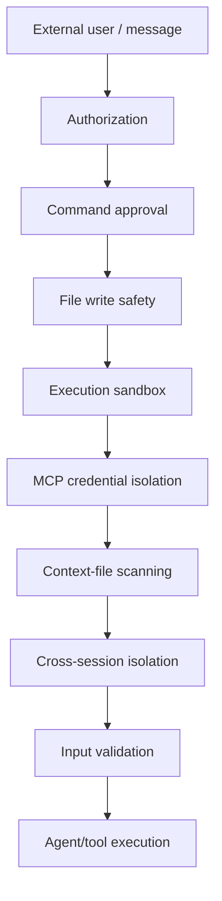

# Hermes Agent — Detailed Architecture & Working

**Source of truth:** Nous Research Hermes Agent developer documentation and architecture pages, reviewed September 2026.

## 1. Executive Summary

Hermes Agent is a platform-agnostic, tool-using AI agent whose central orchestration core is `AIAgent`. The same core can be invoked from multiple entry points — interactive CLI, messaging gateway, ACP/IDE integration, batch execution, and programmatic/API surfaces. Platform-specific concerns are intentionally pushed to adapters and entry-point layers rather than duplicated in the agent core.

At a high level the system is:



The essential idea is an **LLM control loop around deterministic runtime services**. The LLM decides what should happen; Hermes resolves providers, validates tool availability, executes tools, persists results, compresses context, handles retries/failover, and routes responses back to the originating interface.

---

## 2. Architectural Principles

### 2.1 One agent core, many transports

The same `AIAgent` abstraction is reused by CLI, gateway, ACP, batch, and other entry points. Messaging-platform differences belong in gateway adapters, while editor protocol differences belong in ACP.

### 2.2 OpenAI-style internal message model

Internally, Hermes normalizes conversations into OpenAI-compatible messages:

```text
system
user
assistant (+ optional tool_calls / reasoning)
tool
```

Provider adapters translate this internal representation to the provider-specific API and then normalize responses back into the same representation.

### 2.3 Registry-driven extensibility

Tools, providers, memory providers, context engines, and plugins use registries/discovery rather than hard-coded switch statements wherever possible.

### 2.4 Prompt stability

The system prompt is divided into stable, context, and volatile tiers. The architecture tries to keep the long-lived prefix stable so provider-side prompt caching remains effective.

### 2.5 Observable and interruptible execution

Tool progress, model thinking, reasoning, status, streaming, clarification and step events are exposed through callbacks. API requests can be interrupted while in flight.

### 2.6 Persistence is first-class

Every important conversational turn can be persisted. Sessions, message history, model usage, lineage, and searchable historical messages are stored in SQLite.

### 2.7 Defense in depth

Authorization, command approval, file safety, execution isolation, credential filtering, prompt-injection scanning, cross-session isolation, and input sanitization form multiple security boundaries.

---

## 3. Major Components

| Component | Primary responsibility | Important source area |
|---|---|---|
| `AIAgent` | Main conversation orchestration | `run_agent.py`, `agent/` |
| Conversation loop | Iteration/turn state machine | `agent/conversation_loop.py`, `agent/turn_*.py` |
| Prompt builder | Build effective system prompt | `agent/prompt_builder.py`, `agent/system_prompt.py` |
| Runtime provider resolver | Provider/model/API-mode selection | `hermes_cli/runtime_provider.py`, `providers/`, provider plugins |
| Tool registry | Registration, availability, schema lookup, dispatch | `tools/registry.py`, `model_tools.py` |
| Toolsets | Group/filter tools | `toolsets.py` |
| Tool executor | Execute tool calls and intercept agent-level tools | `agent/tool_executor.py` |
| Session store | Persist conversations and metadata | `hermes_state.py`, `gateway/session.py` |
| Memory manager | Curated persistent memory | `agent/memory_manager.py`, memory files |
| Context engine | Detect and perform compaction | `agent/context_engine.py`, `agent/context_compressor.py` |
| Gateway | Long-running platform router | `gateway/` |
| Cron | Scheduled agent execution | `cron/` |
| Skills | Reusable procedural knowledge | `skills/`, skill tools |
| Plugins | Extend tools/hooks/commands/providers | `hermes_cli/plugins.py`, `plugins/` |
| ACP adapter | IDE-native JSON-RPC interface | `acp_adapter/` |

---

# 4. Entry Points

Hermes has multiple ways to start work, but they converge on the same agent runtime.



## 4.1 CLI

Typical path:

```text
User input
  -> HermesCLI.process_input()
  -> AIAgent.run_conversation()
  -> model/tool loop
  -> final response
  -> terminal rendering
  -> session persistence
```

`chat()` is a convenience wrapper over `run_conversation()` and returns the final response string.

## 4.2 Gateway

The gateway is a long-running process that accepts events from external messaging platforms. Its job is not to reason about tasks; its job is to authenticate, route, manage session identity/state, invoke the common agent core, and deliver results.

```text
Platform event
  -> platform adapter
  -> MessageEvent
  -> GatewayRunner
  -> authorization
  -> session key resolution
  -> AIAgent
  -> response
  -> delivery adapter
```

## 4.3 ACP

ACP wraps the synchronous Hermes agent in an async JSON-RPC stdio server. Stdout is reserved for protocol traffic; human-readable diagnostics go to stderr.

---

# 5. The Agent Core

The most important abstraction is `AIAgent`.

The current architecture has moved the loop out of the monolithic `run_agent.py`: `run_agent.py` acts as the facade, while `agent/conversation_loop.py` and focused `agent/turn_*.py` modules implement iteration preparation, API calls, API-error handling, overflow, truncation, and recovery.

## 5.1 Responsibilities

`AIAgent` coordinates:

1. Effective system prompt assembly.
2. Tool schema generation.
3. Provider/API-mode resolution.
4. Model invocation.
5. Tool-call execution.
6. Conversation history management.
7. Interrupt/cancellation handling.
8. Compression/context management.
9. Retry and fallback behavior.
10. Parent/child iteration budgets.
11. Persistent memory flushing.
12. Session persistence.

The agent is therefore best understood as an **orchestration state machine**, not merely as a wrapper around an LLM API.

---

# 6. Core Agent Loop

## 6.1 Canonical lifecycle



## 6.2 Why the loop repeats

A modern coding agent normally does not perform one LLM call. Instead:

```text
User request
   ↓
LLM decides next action
   ↓
LLM emits tool call
   ↓
Hermes executes tool
   ↓
Tool result enters conversation
   ↓
LLM observes result
   ↓
LLM decides next action
   ↓
...
   ↓
LLM produces final response
```

This is the essential **ReAct/tool-loop** pattern, with Hermes adding production controls around it.

---

# 7. Message Model

Hermes normalizes messages into an OpenAI-compatible structure.

```json
{
  "role": "assistant",
  "content": "...",
  "tool_calls": [
    {
      "id": "call_123",
      "type": "function",
      "function": {
        "name": "terminal",
        "arguments": "{...}"
      }
    }
  ]
}
```

A corresponding tool result is:

```json
{
  "role": "tool",
  "tool_call_id": "call_123",
  "content": "command output"
}
```

## 7.1 Message alternation

The loop enforces provider-compatible alternation:

```text
system
user
assistant
user
assistant
...
```

During tool execution:

```text
assistant(tool_calls)
tool
tool
...
assistant
```

Parallel tool results can appear consecutively as `tool` messages, but Hermes avoids invalid consecutive `user` or `assistant` messages.

---

# 8. Provider Abstraction

Hermes supports three principal API execution modes:

| API mode | Typical use | Internal client behavior |
|---|---|---|
| `chat_completions` | OpenAI-compatible providers | OpenAI client / chat-completions semantics |
| `codex_responses` | OpenAI Codex / Responses | Responses API conversion |
| `anthropic_messages` | Native Anthropic | Anthropic client plus adapter |

All three converge on the same internal conversation representation.

## 8.1 Provider resolution

Provider runtime resolution is shared across CLI, gateway, cron, ACP and auxiliary model requests.

High-level precedence:

```text
1. Explicit runtime / CLI request
2. config.yaml model/provider configuration
3. Environment variables
4. Provider defaults / automatic resolution
```

The resolver returns information such as:

```text
provider
api_mode
base_url
api_key
source
provider-specific metadata
```

## 8.2 Why a resolver matters

Without a centralized resolver, every entry point would need its own provider-selection logic. That would make behavior diverge between CLI, gateway, scheduled jobs and IDE integration.

Hermes instead creates a single runtime contract:

```text
(provider, model)
      ↓
ProviderProfile
      ↓
(api_mode, base_url, credential source, fallbacks)
```

## 8.3 Failover

When a primary provider fails, Hermes can attempt configured fallback providers. Authentication failures may trigger credential refresh before failover.

Auxiliary operations such as vision, compression and extraction have independent routing/fallback configurations.

---

# 9. Prompt Architecture

Prompt construction is deliberately separated from the conversation history.

The cached system prompt is organized into three tiers:

```text
SYSTEM PROMPT
├── stable
│   ├── identity / SOUL.md
│   ├── tool guidance
│   ├── model guidance
│   ├── skills index
│   ├── environment hints
│   └── platform hints
│
├── context
│   ├── caller supplied system_message
│   └── project context files
│       ├── .hermes.md / HERMES.md
│       ├── AGENTS.md
│       ├── CLAUDE.md
│       └── .cursorrules / Cursor rules
│
└── volatile
    ├── MEMORY.md snapshot
    ├── USER.md snapshot
    ├── external memory provider context
    └── time/session/model/provider information
```

The effective order is:

```text
stable → context → volatile
```

## 9.1 Why the split exists

The system prompt is expensive to transmit and is a natural target for prefix caching. Mutable call-specific information is therefore kept outside the frozen system-prompt structure whenever possible.

This creates a useful boundary:

```text
Long-lived instructions  ---> stable cacheable prefix
Session/project context  ---> context tier
Current execution state  ---> ephemeral API-call-time additions
```

## 9.2 Context files

Hermes treats project instruction files as separate from the agent's personal identity/memory.

A useful conceptual distinction is:

```text
SOUL.md      = who the agent is
USER.md      = who the user is
MEMORY.md    = what the agent has learned
AGENTS.md    = what the project requires
.hermes.md   = Hermes-specific project instruction
```

---

# 10. Skills Architecture

Skills are an important architectural distinction from tools.

A **tool** provides executable capability.

A **skill** provides procedural knowledge/instructions telling the model how to use existing capabilities.

```text
Skill
├── SKILL.md
├── references/
├── scripts/
└── templates/
```

## 10.1 Progressive disclosure

Hermes does not load the full content of every skill into context at session start.

Instead:

```text
Session start
    ↓
skills_list()
    ↓
compact names + descriptions
    ↓
model decides a skill is relevant
    ↓
skill_view(name)
    ↓
full SKILL.md
    ↓
optional reference/script/template lookup
```

This avoids paying token cost for irrelevant capabilities.

## 10.2 When to implement a tool vs skill

Use a skill when the capability can be expressed as procedures + existing tools/CLIs.

Use a tool when the capability needs deterministic integration, specialized authentication/API handling, binary/stream processing, or another component that should execute directly.

## 10.3 Skill security

Installed/community skills are security-scanned for prompt injection, exfiltration patterns and destructive/shell-injection behaviors. Skills may also declare required environment variables, but secrets are stored outside model-visible context.

---

# 11. Tool System

Hermes tools use a central registry.

```mermaid
flowchart LR
    FILE[tools/foo.py]
    REG[ToolRegistry]
    DISC[Discovery]
    DEF[get_definitions]
    MODEL[LLM tool schema]
    CALL[tool_call]
    DISP[dispatch]
    HANDLER[handler]

    FILE -->|register() at import time| REG
    DISC --> REG
    REG --> DEF --> MODEL
    MODEL --> CALL --> DISP --> HANDLER
```

## 11.1 Self-registration

A tool module typically performs a registration similar to:

```python
registry.register(
    name="terminal",
    toolset="terminal",
    schema={...},
    handler=handle_terminal,
    check_fn=check_terminal,
    is_async=False,
)
```

The registry stores a `ToolEntry` keyed by tool name.

## 11.2 Automatic discovery

Built-in tools are discovered by scanning `tools/*.py` and checking, via AST inspection, which files contain top-level registration calls. Those modules are imported, which triggers registration.

Therefore the extension workflow becomes:

```text
Create tools/my_tool.py
        ↓
Top-level registry.register(...)
        ↓
Automatic discovery
        ↓
Tool schema available to agent
```

This removes the need for a giant manually maintained import list.

## 11.3 Tool availability

A tool can define `check_fn()` for runtime availability.

Typical checks include:

```text
API key exists
binary installed
external service configured
optional dependency importable
```

Unavailable tools are filtered rather than being exposed to the model.

## 11.4 Toolsets

A toolset is a logical bundle of tools.

Examples conceptually include:

```text
terminal
browser
web
memory
skills
MCP
```

Tool definitions are filtered based on enabled/disabled toolsets and availability.

## 11.5 Dispatch path

```text
LLM tool_call
   ↓
agent loop
   ↓
agent-level tool interception?
   ├── yes → direct state-aware handling
   └── no
        ↓
plugin pre-tool hook
        ↓
registry.dispatch()
        ↓
resolve ToolEntry
        ↓
async bridge if required
        ↓
handler
        ↓
post-tool hook
        ↓
result appended to history
```

---

# 12. Agent-Level Tools

Not every tool goes through the ordinary registry path.

Certain tools need direct access to agent state:

| Tool | Reason |
|---|---|
| `todo` | Agent-local task state |
| `memory` | Persistent memory files and limits |
| `session_search` | Session database access |
| `delegate_task` | Creates isolated child agents |

These are intercepted by the agent tool-execution layer and return synthetic results to the model.

This is a useful architectural pattern: **capabilities that mutate orchestration state should live closer to the orchestration engine than generic external tools do.**

---

# 13. Tool Concurrency

Hermes executes multiple independent tool calls concurrently when possible.

```text
Model response
   ├── terminal(A)
   ├── web_search(B)
   └── read_file(C)

          ↓ ThreadPoolExecutor

A completes ─┐
B completes ──┼─ results reordered into original tool-call order
C completes ─┘
```

Single calls can execute directly. Interactive tools force sequential execution.

The important property is that **completion order does not alter model-visible tool ordering**.

---

# 14. Terminal Execution Architecture

The terminal abstraction is intentionally backend-neutral.

Conceptually:

```text
terminal tool
     ↓
execution environment abstraction
     ├── local
     ├── Docker
     ├── SSH
     ├── Daytona
     ├── Modal
     ├── Singularity
     └── other supported backends
```

This allows the agent's reasoning layer to say “run this command” without encoding whether execution occurs on the local machine or inside an isolated remote/container environment.

That separation is particularly important for a coding agent: **reasoning, tool semantics and sandbox policy are different concerns.**

---

# 15. Memory Architecture

Hermes uses bounded built-in memory plus optional external memory providers.

## 15.1 Built-in memory

Two curated stores are used:

```text
MEMORY.md
  Agent/environment/project notes

USER.md
  User profile, preferences and working style
```

They have intentionally small character budgets so memory remains focused rather than turning into another unbounded transcript.

## 15.2 Memory lifecycle



The prompt receives a **frozen snapshot** of built-in memory at session start. Writes can happen during a session and are persisted immediately, but the cached system-prompt snapshot does not mutate mid-session.

This is a deliberate tradeoff between immediate visibility and prompt-cache stability.

## 15.3 External memory providers

Optional external providers are additive. Hermes can inject provider context, prefetch relevant memories, synchronize turns, and expose provider-specific tools.

Architecture:

```text
Built-in memory
      +
External memory provider plugin
      ↓
Context injected into agent
      ↓
Agent response
      ↓
Provider synchronization
```

Examples of provider capabilities include semantic search, user modeling and knowledge graphs.

---

# 16. Session Storage

Hermes uses SQLite with WAL mode for session state.

Conceptual schema:

```text
~/.hermes/state.db
├── sessions
├── messages
├── session_model_usage
├── messages_fts
├── messages_fts_trigram
├── messages_fts_cjk
├── state_meta
└── gateway_routing
```

## 16.1 Why SQLite

The agent is primarily local and single-profile. SQLite provides:

- durable local persistence
- transactional writes
- efficient reads
- concurrency through WAL
- zero external database service
- FTS5 search

## 16.2 Messages table

A message can contain:

```text
id
session_id
role
content
tool_call_id
tool_calls
tool_name
timestamp
token_count
finish_reason
reasoning / reasoning_content
provider-specific response fields
compaction/display metadata
```

## 16.3 Full-text search

FTS5 indexes allow the agent to retrieve actual historical messages without an additional LLM summarization call.

Different tokenization/indexing strategies support ordinary, substring and CJK-oriented retrieval.

## 16.4 Session lineage

Compression can create child sessions/lineage relationships. This means historical context is not simply thrown away; the compressed session remains linked to its predecessor.

Conceptually:

```text
Session A
  ├── messages 1...N
  │
  └── compression
        ↓
Session B (child)
  ├── summary of A's middle
  └── preserved recent tail
```

---

# 17. Context Compression

Long-running agents eventually exceed practical context limits. Hermes addresses this with a pluggable context engine.



## 17.1 Pluggable ContextEngine

`ContextEngine` defines the interface for deciding when and how compaction occurs.

The built-in compressor can be replaced by a plugin implementation.

Typical responsibilities:

```text
should_compress()
compress()
update_from_response()
optional agent-facing context tools
```

## 17.2 Two compression boundaries

Hermes separates compression responsibilities between the normal agent loop and gateway/session hygiene.

The default agent-loop preflight uses a lower threshold so context pressure is handled before an API call becomes unsafe. Gateway hygiene can perform more aggressive preparation between turns.

## 17.3 Compression algorithm concept

A typical compaction operation:

```text
1. Flush durable memory
2. Identify middle conversation span
3. Summarize middle span
4. Preserve recent messages intact
5. Keep tool call/result pairs together
6. Replace large middle history with summary
7. Continue execution
```

The goal is not merely to “truncate text”; it is to preserve the semantic state required to continue the task.

---

# 18. Prompt Caching

Anthropic caching is integrated into the prompt lifecycle.

The important architectural constraint is:

```text
Stable prompt prefix
        ↓
cacheable

Ephemeral execution data
        ↓
added per API call
```

This reduces the cost and latency of repeatedly transmitting large, identical system instructions.

Therefore prompt design is not just about “what instructions should the model see?” It is also a **cache locality problem**.

---

# 19. Gateway Architecture

The gateway converts multiple messaging systems into one normalized agent invocation interface.



## 19.1 Session key

The gateway encodes routing identity in a session key conceptually like:

```text
agent:main:{platform}:{chat_type}:{chat_id}
```

Thread-aware platforms can incorporate thread identity into the routed chat identity.

This makes platform/chat isolation explicit.

## 19.2 Two-level message guard

When an agent is already running, the gateway uses two guards to prevent races:

```text
Incoming message
      ↓
Adapter-level active-session guard
      ↓
queue + signal interrupt
      ↓
Gateway-level running-agent guard
      ↓
route commands / interrupt running agent
```

Special control messages such as approval commands can bypass background queueing when required to avoid deadlock/race conditions.

## 19.3 Authorization

Authorization can involve:

```text
platform-wide allow-all
→ platform allowlist
→ DM pairing
→ global allow-all
→ default deny
```

The exact active configuration determines whether the request proceeds.

---

# 20. Cron / Scheduled Agents

Hermes cron jobs are **agent executions**, not merely shell jobs.



Supported schedule classes include relative delays, recurring intervals, cron expressions and ISO timestamps.

## 20.1 Job lifecycle

```text
scheduled
   ↓
running
   ↓
completed
```

or for recurring work:

```text
scheduled → running → scheduled → running → ...
```

Paused jobs remain persisted but do not execute until resumed.

## 20.2 Skill-backed jobs

A cron job can attach skills. At execution time:

```text
load skills
   ↓
inject skill instructions
   ↓
append job prompt
   ↓
run fresh AIAgent
```

This separates reusable workflow definition from scheduling metadata.

---

# 21. Subagent Delegation

`delegate_task` creates child agent instances with isolated context/tool environments.

Conceptually:



The architectural benefit is **context isolation**. A child can solve a focused subproblem without consuming the parent's full working context.

Parent and child agents track iteration budgets separately, with child limits capped by delegation settings.

---

# 22. Plugin Architecture

Hermes supports multiple discovery sources, conceptually:

```text
~/.hermes/plugins/      user plugins
.hermes/plugins/        project plugins
pip entry points        installed plugins
```

Plugins can contribute:

- tools
- hooks
- CLI commands
- memory providers
- context engines
- model providers

A useful plugin pipeline is:

```text
plugin discovery
      ↓
plugin load
      ↓
registration into registry
      ↓
agent runtime consumes extension
```

Specialized provider families such as memory providers and context engines are single-select, configured explicitly, while generic tool/hook extensions can coexist.

---

# 23. Lifecycle Hooks and Callbacks

Hermes exposes runtime events rather than keeping progress invisible.

Representative callbacks include:

```text
tool_progress_callback
thinking_callback
reasoning_callback
clarify_callback
step_callback
stream_delta_callback
tool_gen_callback
status_callback
```

The same agent core can therefore support very different UX layers:

```text
                 AIAgent
                    │
        ┌───────────┼───────────┐
        ↓           ↓           ↓
      CLI         Gateway       ACP
    spinner      chat status   JSON-RPC status
```

This is a strong example of keeping **execution semantics independent from presentation semantics**.

---

# 24. Interrupt and Cancellation Model

Model calls are wrapped in an interruptible execution mechanism.

Conceptually:

```text
Main agent thread
      │
      ├── wait for response
      ├── watch interrupt event
      └── enforce timeout
                │
                ▼
          API worker thread
                │
                ▼
             provider
```

When interrupted, the in-flight API worker can be abandoned and its partial response is not injected into the conversation history.

This matters for an interactive coding agent because a user may say:

```text
“stop”
“actually do X instead”
“cancel that”
```

without waiting for the previous model call to finish.

---

# 25. Reliability Architecture

Hermes treats failures as part of the normal runtime model.

## 25.1 Failure classes

```text
Provider/API failure
   ├── transient error
   ├── rate limit
   ├── server error
   └── authentication error

Tool failure
   ├── validation failure
   ├── runtime exception
   ├── missing dependency
   └── unavailable environment

Context failure
   ├── overflow
   └── malformed/truncated history

Execution failure
   ├── approval denied
   ├── sandbox rejection
   └── process failure
```

The agent runtime has dedicated paths for API errors, overflow, truncation and recovery rather than handling every condition in one generic exception block.

---

# 26. Security Architecture

Hermes uses defense in depth.



The documented security boundaries include:

1. User authorization through allowlists and pairing.
2. Human approval for dangerous/destructive commands.
3. File-write denylisting and optional write sandboxing.
4. Docker/Singularity/Modal-style isolation options.
5. MCP subprocess credential filtering.
6. Prompt-injection scanning of context files.
7. Session and cron-storage isolation.
8. Validation/sanitization of working-directory and terminal inputs.

For a coding agent, the most important architectural point is that **the model is not the security boundary**. Runtime enforcement must happen outside the model's natural-language reasoning.

---

# 27. End-to-End Example: “Fix the bug in main.py”

This is the most useful mental model for understanding Hermes.

```text
1. User enters request
   |
   v
2. CLI/Gateway resolves the active session
   |
   v
3. AIAgent starts a conversation turn
   |
   v
4. Prompt Builder assembles:
      SOUL + project rules + memory + skills + environment
   |
   v
5. Runtime provider resolver chooses model/provider/API mode
   |
   v
6. Tool registry produces currently available tool schemas
   |
   v
7. Hermes calls the LLM
   |
   v
8. Model says:
      terminal("pytest ...")
   |
   v
9. Tool executor:
      availability → approval → backend → result
   |
   v
10. Tool result is appended to message history
    |
    v
11. LLM receives failure output
    |
    v
12. LLM decides to inspect main.py
    |
    v
13. read_file tool executes
    |
    v
14. LLM proposes a patch
    |
    v
15. write/patch tool executes
    |
    v
16. Tests are run
    |
    v
17. LLM verifies result
    |
    v
18. Final response returned
    |
    v
19. Session persisted to SQLite
    |
    v
20. Memory/skill improvements may be persisted separately
```

The core loop therefore creates a **closed control system**:

```text
Observe → reason → act → observe → reason → act → verify
```

---

# 28. Data Ownership Boundaries

A useful way to reason about Hermes is to assign ownership explicitly.

| Data | Owner | Lifetime |
|---|---|---|
| Conversation messages | Session store / AIAgent | Session + historical storage |
| System prompt inputs | Prompt builder | Session/run |
| Model/provider selection | Runtime provider layer | Config/profile/run |
| Tool definitions | Registry | Process/runtime |
| Tool results | Conversation + session store | Session history |
| MEMORY.md / USER.md | Memory manager | Cross-session |
| Skill definitions | Skills system | Persistent profile/project |
| Scheduled jobs | Cron subsystem | Persistent job store |
| Gateway routing | Gateway | Profile/runtime + persistence |
| Child-agent context | Child AIAgent | Child task lifetime |

This decomposition prevents a common agent-architecture mistake: allowing the “agent” object to become the owner of every kind of state.

---

# 29. Dependency Direction

A simplified dependency direction is:

```text
Entry Points
     ↓
AIAgent / Conversation Loop
     ↓
Prompt / Provider / Tool Execution / Context
     ↓
Registries + Backends + Persistence
```

Tool modules depend on the registry, while the registry should not depend on concrete tool implementations.

The same pattern applies to provider plugins: the runtime resolver asks a provider registry for metadata rather than containing a large hard-coded provider matrix.

This is effectively a **ports-and-adapters architecture** around a central orchestration engine.

---

# 30. Recommended Repository Mental Map

```text
hermes-agent/
│
├── run_agent.py                 # public AIAgent facade
├── model_tools.py               # tool discovery/schema/dispatch bridge
├── toolsets.py                  # tool grouping
├── hermes_state.py              # SQLite state
├── hermes_constants.py          # profile/home paths
│
├── agent/
│   ├── conversation_loop.py     # loop implementation
│   ├── turn_*.py                # turn phase implementations
│   ├── prompt_builder.py        # prompt construction
│   ├── system_prompt.py         # prompt tier assembly
│   ├── context_engine.py        # context abstraction
│   ├── context_compressor.py    # default compression
│   ├── prompt_caching.py        # cache integration
│   ├── tool_executor.py         # tool execution
│   ├── memory_manager.py        # memory orchestration
│   ├── auxiliary_client.py      # side-task LLMs
│   └── trajectory.py            # trajectory persistence/export
│
├── tools/
│   ├── registry.py              # central tool registry
│   ├── terminal_tool.py         # terminal interface
│   ├── environments/            # execution backends
│   └── ...                      # built-in tools
│
├── hermes_cli/
│   ├── main.py                  # CLI entry point
│   ├── runtime_provider.py      # provider resolution
│   ├── auth.py                  # credential resolution
│   ├── plugins.py               # plugin discovery/loading
│   └── environments/             # CLI-visible environments
│
├── gateway/
│   ├── run.py                   # gateway facade
│   ├── session.py               # routing/session model
│   ├── delivery.py              # outbound delivery
│   ├── pairing.py               # authorization pairing
│   ├── hooks.py                 # hook lifecycle
│   └── platforms/               # messaging adapters
│
├── cron/
│   ├── jobs.py                  # persistent jobs model
│   └── scheduler.py             # scheduler runtime
│
├── plugins/
│   └── ...                      # extension families
│
├── skills/
│   └── ...                      # procedural knowledge
│
└── acp_adapter/
    └── ...                      # IDE/ACP protocol adapter
```

---

# 31. What Makes Hermes Different From a Basic LLM Wrapper

A basic implementation is often:

```text
prompt → LLM → response
```

Hermes is closer to:

```text
                  ┌───────────────────────┐
                  │    Entry / Gateway    │
                  └───────────┬───────────┘
                              ↓
                    ┌──────────────────┐
                    │   AIAgent Loop   │
                    └───────┬──────────┘
                            ↓
       ┌────────────────────┼────────────────────┐
       ↓                    ↓                    ↓
  Prompt System       Tool Runtime        Provider Runtime
       ↓                    ↓                    ↓
  Memory / Skills     Sandboxed Exec        Failover / Auth
       └────────────────────┼────────────────────┘
                            ↓
                     Context Engine
                            ↓
                      Session Store
                            ↓
                       Observability
```

The hard engineering is not the HTTP request to the model. It is the **runtime around the model**.

---

# 32. Architecture Patterns Worth Reusing in Your Own Coding Agent

If the purpose of studying Hermes is to design your own terminal coding agent, the most reusable ideas are:

### Pattern A — One core agent, many interfaces

Do not implement one “CLI agent” and another “Discord agent.” Implement one runtime and thin adapters.

### Pattern B — Internal message normalization

Normalize provider-specific message formats at the boundary. Keep your agent loop provider-neutral.

### Pattern C — Registry-based tools

A tool should declare:

```text
name
schema
handler
availability check
metadata
```

Then a central registry controls discovery and execution.

### Pattern D — Separate reasoning from execution

The LLM proposes actions; deterministic executors perform them. Security checks must happen in the executor, not in the prompt.

### Pattern E — Progressive disclosure

Do not stuff all documentation into every prompt. Provide compact indexes, then load detailed instructions only when needed.

### Pattern F — Session persistence independent from prompt context

Persist the full session even when the active model context is compacted. This lets you recover exact historical messages.

### Pattern G — Context management as an abstraction

Make compression a replaceable interface from day one. This allows later experiments with lossless context, retrieval, or provider-native compaction.

### Pattern H — Separate main-model and auxiliary-model workloads

Vision, summarization, extraction and classification often have different latency/cost requirements than the primary reasoning model.

### Pattern I — Treat interruption as a first-class state transition

A coding agent must react to the human while work is happening.

### Pattern J — Stable prompt + ephemeral execution context

This is particularly important if you plan to support Anthropic-style prompt caching.

---

# 33. Suggested Architecture for a New Coding-Agent Implementation

A clean implementation inspired by Hermes can be simplified to:

```text
src/
├── core/
│   ├── agent.ts
│   ├── conversation-loop.ts
│   ├── turn-state.ts
│   └── iteration-budget.ts
│
├── llm/
│   ├── provider.ts
│   ├── provider-registry.ts
│   ├── openai-adapter.ts
│   └── anthropic-adapter.ts
│
├── prompt/
│   ├── builder.ts
│   ├── system-prompt.ts
│   └── context.ts
│
├── tools/
│   ├── registry.ts
│   ├── executor.ts
│   ├── terminal.ts
│   ├── filesystem.ts
│   └── git.ts
│
├── execution/
│   ├── local.ts
│   ├── docker.ts
│   └── sandbox.ts
│
├── memory/
│   ├── manager.ts
│   ├── short-term.ts
│   └── persistent.ts
│
├── context/
│   ├── engine.ts
│   └── compressor.ts
│
├── skills/
│   ├── registry.ts
│   └── loader.ts
│
├── sessions/
│   ├── store.ts
│   └── search.ts
│
├── interfaces/
│   ├── cli.ts
│   └── gateway.ts
│
└── security/
    ├── approval.ts
    ├── sandbox-policy.ts
    └── prompt-injection.ts
```

The resulting runtime becomes:

```text
                Interface
                   ↓
            Conversation Loop
                   ↓
          ┌────────┼────────┐
          ↓        ↓        ↓
       Prompt     LLM      Tools
          ↓        ↓        ↓
       Memory   Provider  Executor
                         ↓
                      Sandbox
                         ↓
                      Result
                         ↓
                    Conversation
                         ↓
                     Session DB
```

This is the smallest architecture that retains most of Hermes's important production properties without reproducing its entire feature surface.

---

# 34. Final Mental Model

The simplest accurate mental model of Hermes Agent is:

> **A persistent, interruptible, provider-agnostic orchestration loop that lets an LLM control a registry of deterministic tools, while a surrounding runtime handles context, memory, security, scheduling, routing, execution environments, and persistence.**

Or as a pipeline:

```text
INPUT
  ↓
ENTRY POINT
  ↓
SESSION / ROUTING
  ↓
PROMPT + TOOLS
  ↓
MODEL
  ↓
DECISION
  ├─────────────── final answer ───────────────┐
  │                                             ↓
  └── tool call → SECURITY → EXECUTION → RESULT
                         ↑              │
                         └──────────────┘
                                   ↓
                              MODEL AGAIN
                                   ↓
                              final answer
                                   ↓
                       persistence / memory / delivery
```

That loop is the heart of Hermes. Everything else exists to make that loop reliable, extensible, safe, persistent, and usable across many interfaces.

---

## Sources

- Nous Research — Hermes Agent Architecture: https://hermes-agent.nousresearch.com/docs/developer-guide/architecture
- Nous Research — Agent Loop Internals: https://hermes-agent.nousresearch.com/docs/developer-guide/agent-loop/
- Nous Research — Prompt Assembly: https://hermes-agent.nousresearch.com/docs/developer-guide/prompt-assembly/
- Nous Research — Tools Runtime: https://hermes-agent.nousresearch.com/docs/developer-guide/tools-runtime/
- Nous Research — Session Storage: https://hermes-agent.nousresearch.com/docs/developer-guide/session-storage
- Nous Research — Gateway Internals: https://hermes-agent.nousresearch.com/docs/developer-guide/gateway-internals/
- Nous Research — Provider Runtime Resolution: https://hermes-agent.nousresearch.com/docs/developer-guide/provider-runtime
- Nous Research — Context Compression and Caching: https://hermes-agent.nousresearch.com/docs/developer-guide/context-compression-and-caching/
- Nous Research — Cron Internals: https://hermes-agent.nousresearch.com/docs/developer-guide/cron-internals/
- Nous Research — Persistent Memory: https://hermes-agent.nousresearch.com/docs/user-guide/features/memory/
- Nous Research — Skills System: https://hermes-agent.nousresearch.com/docs/user-guide/features/skills/
- Nous Research — Security: https://hermes-agent.nousresearch.com/docs/user-guide/security
