# PπBot → Hermes-Class Agent Runtime: Phased Implementation Plan

> **Objective:** Evolve PπBot from a solid MVP coding-agent loop into a modular, persistent, extensible coding-agent runtime inspired by the Hermes Agent architecture — without a big-bang rewrite.

## Current State Summary

PπBot today has:
- A **monolithic** `AgentRuntime` class that owns context building, provider calls, tool execution, safety checks, and streaming — all inside a single `processMessage()` method
- **In-memory only** `ConversationState` — no persistence, no session resume
- A **static** `ContextBuilder` — no tiered prompts, no project context discovery, no token budgeting, no compression beyond simple sliding-window
- A **flat** `ToolRegistry` — no toolsets, no concurrency, no lifecycle hooks, no execution runtime separation
- **Tight coupling** between the REPL and runtime internals (REPL directly accesses `runtime.conversationState`, `runtime.providerRegistry`, etc.)
- **No** EventBus, cancellation (AbortSignal), session persistence, memory, skills, process manager, git tools, checkpoints, verification engine, subagents, plugins, or MCP

The architecture is functional but monolithic. Every new capability would need to enter the same `AgentRuntime` class.

---

## Phasing Strategy

The plan is split into **10 phases**, ordered by dependency and value. Each phase produces a **shippable, working PπBot** — no phase leaves the system broken.

> [!IMPORTANT]
> **Rule: Extract, don't rewrite.** Each phase extracts responsibility from existing code into a new subsystem. Existing tests must continue to pass at every step.

---

## Phase 0 — Baseline & Contracts (Foundation)

**Goal:** Freeze current behavior with tests. Establish the type contracts that every subsequent phase will build on.

**What we're doing:** Creating the "safety net" so we can refactor fearlessly.

### [NEW] [domain-types.ts](file:///c:/Users/sagni/ai_projects/PπBot/src/types/domain-types.ts)
Define stable core domain types that replace the ad-hoc types scattered across the codebase:
```ts
// Normalized message types
interface Message { role; content; toolCalls?; toolCallId?; name?; timestamp; }
interface ToolCall { id; name; arguments; }
interface ToolResult { ok; output; error?; metadata?; }

// Agent boundary types  
interface AgentInput { sessionId?; message; cwd; signal?: AbortSignal; }
interface AgentResult { sessionId; status: 'completed'|'failed'|'cancelled'|'max_iterations'; message?; }

// Normalized error hierarchy
abstract class AgentError extends Error { code; retryable; userVisible; }
```

### [MODIFY] [agent-runtime.ts](file:///c:/Users/sagni/ai_projects/PπBot/src/core/agent-runtime.ts)
- Add `AbortSignal` parameter to `processMessage()`
- Migrate to new domain types
- **Do NOT restructure the method yet** — just make the type contract stable

### [MODIFY] [base-provider.ts](file:///c:/Users/sagni/ai_projects/PπBot/src/providers/base-provider.ts)
- Add `signal?: AbortSignal` to `generateResponse()`

### [MODIFY] All tool files
- Ensure all tools return the normalized `ToolResult` type

### [NEW] Test suite
- Add integration tests covering: basic conversation, tool execution, safety denial, multi-turn tool loops, context overflow

### Completion Criteria
- ✅ All existing CLI behavior unchanged
- ✅ Core domain types documented and exported
- ✅ `AbortSignal` threaded through provider and runtime APIs
- ✅ Baseline test suite passing

### Estimated Effort: **2-3 sessions**

---

## Phase 1 — Extract Agent Runtime (Orchestration Refactor)

**Goal:** Make `AgentRuntime` a thin orchestrator over explicit subsystems. Decouple the REPL from runtime internals.

> [!IMPORTANT]
> This is the most structurally important phase. It sets the architectural backbone for everything that follows.

### New Directory Structure
```text
src/agent/
├── agent-runtime.ts       # Thin orchestrator
├── conversation-loop.ts   # The think→act→observe iteration machine  
├── turn-runner.ts         # Single logical turn lifecycle
├── turn-result.ts         # Turn result types
└── cancellation.ts        # AbortController wrapper

src/events/
├── event-bus.ts           # Typed EventEmitter
└── event-types.ts         # All agent event discriminated unions
```

### [NEW] [event-bus.ts](file:///c:/Users/sagni/ai_projects/PπBot/src/events/event-bus.ts)
Typed event emitter with these event types:
```ts
type AgentEvent =
  | { type: 'session.started'; sessionId: string }
  | { type: 'turn.started'; turnId: string }
  | { type: 'model.started'; model: string }
  | { type: 'model.delta'; text: string }
  | { type: 'model.completed'; usage?: Usage }
  | { type: 'tool.started'; toolCallId: string; name: string }
  | { type: 'tool.stdout'; toolCallId: string; chunk: string }
  | { type: 'tool.completed'; toolCallId: string; result: ToolResult }
  | { type: 'approval.requested'; approvalId: string; command: string }
  | { type: 'approval.resolved'; approvalId: string; approved: boolean }
  | { type: 'context.compressed'; before: number; after: number }
  | { type: 'turn.completed'; turnId: string; result: TurnResult }
  | { type: 'agent.error'; error: AgentError }
```

### [NEW] [conversation-loop.ts](file:///c:/Users/sagni/ai_projects/PπBot/src/agent/conversation-loop.ts)
Extract the iteration loop out of `processMessage()`:
- Owns: iteration lifecycle, model call, response parsing, tool-call dispatch, continuation, stop conditions, max-iteration handling
- Emits events instead of calling StreamCallbacks directly

### [NEW] [turn-runner.ts](file:///c:/Users/sagni/ai_projects/PπBot/src/agent/turn-runner.ts)
Owns a single logical turn:
```text
Turn Started → Context Preflight → Build Request → Resolve Provider →
Generate Response → Parse Response → Tool Calls? → Policy Check →
Execute Tools → Persist Results → Context Pressure Check → Next iteration
```

### [MODIFY] [agent-runtime.ts](file:///c:/Users/sagni/ai_projects/PπBot/src/agent/agent-runtime.ts) (moved to `src/agent/`)
Becomes a thin facade:
```ts
async run(input: AgentInput): Promise<AgentResult> {
  const session = this.resolveSession(input);
  const result = await this.conversationLoop.run({ session, input, signal: input.signal });
  return result;
}
```

### [MODIFY] [repl.ts](file:///c:/Users/sagni/ai_projects/PπBot/src/repl.ts)
- Subscribe to `EventBus` events instead of using StreamCallbacks
- Remove direct access to `runtime.conversationState`, `runtime.providerRegistry`
- The REPL becomes a **renderer of events**, not a runtime participant

### Completion Criteria
- ✅ REPL has **zero** provider-specific or tool-specific logic
- ✅ `AgentRuntime` can be invoked programmatically without the REPL
- ✅ Ctrl+C cleanly cancels a running turn via AbortSignal
- ✅ All events are observable through EventBus
- ✅ Existing tests still pass

### Estimated Effort: **3-4 sessions**

---

## Phase 2 — Context Engine

**Goal:** Replace the static prompt builder with a real context subsystem that handles tiered prompts, token budgeting, project context, and intelligent compression.

### New Directory Structure
```text
src/context/
├── context-engine.ts        # Main context subsystem
├── prompt-builder.ts        # Tiered prompt assembly
├── project-context.ts       # .pibot/agent.md, AGENTS.md discovery
├── token-budget.ts          # Token budget calculation
├── context-compressor.ts    # Intelligent compression
└── preservation-policy.ts   # What to keep during compression
```

### [NEW] [context-engine.ts](file:///c:/Users/sagni/ai_projects/PπBot/src/context/context-engine.ts)
Main interface:
```ts
interface ContextEngine {
  build(input: ContextBuildInput): Promise<ModelContext>;
  estimateTokens(context: ModelContext): number;
  shouldCompress(context: ModelContext): boolean;
  compress(context: ModelContext): Promise<ModelContext>;
}
```

### [NEW] [prompt-builder.ts](file:///c:/Users/sagni/ai_projects/PπBot/src/context/prompt-builder.ts)
Tiered prompt assembly:
```text
Stable    → identity, core instructions, tool usage rules
Project   → AGENTS.md, .pibot/agent.md, inherited instructions
Durable   → MEMORY.md, USER.md (Phase 7)
Volatile  → current task, cwd, model, runtime status
```
Stable content stays identical across turns for **prompt cache effectiveness**.

### [NEW] [token-budget.ts](file:///c:/Users/sagni/ai_projects/PπBot/src/context/token-budget.ts)
Replace the naive `if (estimatedTokens > 80_000)` with a proper budget:
```ts
interface TokenBudget {
  maxContextTokens: number;      // from model capabilities
  reservedOutputTokens: number;
  systemTokens: number;
  projectTokens: number;
  memoryTokens: number;
  toolTokens: number;
  historyTokens: number;
  availableHistoryTokens: number; // computed
  safetyReserve: number;
}
```

### [NEW] [context-compressor.ts](file:///c:/Users/sagni/ai_projects/PπBot/src/context/context-compressor.ts)
Replace sliding-window-only pruning with intelligent compression:
- **Preserve:** original objective, unresolved requirements, architectural decisions, files modified, tests run, failed commands, active task state
- **Remove:** repeated tool output, stale exploratory details, redundant conversational text, superseded decisions
- Keep tool_call/result pairs together (never orphan them)

### [NEW] [project-context.ts](file:///c:/Users/sagni/ai_projects/PπBot/src/context/project-context.ts)
Hierarchical project instruction discovery:
```text
Global → Repository root → Subdirectory → File-specific
```
Supported files: `AGENTS.md`, `.pibot/agent.md`, `.pibot/instructions.md`, `CLAUDE.md`

### [DELETE] [context-builder.ts](file:///c:/Users/sagni/ai_projects/PπBot/src/core/context-builder.ts)
Replaced by the `context/` module.

### Completion Criteria
- ✅ Context assembly is deterministic and testable
- ✅ Token budget is calculated per-model (uses `maxContextTokens` from provider)
- ✅ Compression preserves task-critical state
- ✅ Tool-call/result pairs remain valid after compression
- ✅ Project instruction files are discovered and included
- ✅ Prompt caching effectiveness is preserved (stable prefix doesn't change between turns)

### Estimated Effort: **3-4 sessions**

---

## Phase 3 — Session Persistence

**Goal:** Make sessions durable. Restarting PπBot doesn't lose history.

### New Directory Structure
```text
src/persistence/
├── session-store.ts     # Session CRUD
├── message-store.ts     # Message persistence
├── search-store.ts      # FTS5 full-text search
└── sqlite-store.ts      # SQLite connection & migrations
```

### [NEW] [sqlite-store.ts](file:///c:/Users/sagni/ai_projects/PπBot/src/persistence/sqlite-store.ts)
SQLite with WAL mode. Schema:
```sql
sessions(id, parent_session_id, cwd, provider, model, status, created_at, updated_at)
messages(id, session_id, role, content, tool_call_id, tool_calls_json, created_at, token_estimate, metadata_json)
tool_calls(id, session_id, message_id, name, arguments_json, status, started_at, completed_at)
tool_results(id, tool_call_id, ok, result_json, created_at)
session_events(id, session_id, type, payload_json, created_at)
session_lineage(parent_session_id, child_session_id)
messages_fts(content) -- FTS5 virtual table
```

### [NEW] [session-store.ts](file:///c:/Users/sagni/ai_projects/PπBot/src/persistence/session-store.ts)
```ts
interface SessionStore {
  create(input: CreateSessionInput): Promise<Session>;
  get(id: string): Promise<Session | null>;
  getRecent(limit?: number): Promise<Session[]>;
  update(id: string, updates: Partial<Session>): Promise<void>;
  appendMessage(sessionId: string, message: Message): Promise<void>;
  listMessages(sessionId: string): Promise<Message[]>;
  search(query: string, options?: SearchOptions): Promise<SearchResult[]>;
}
```

### [MODIFY] [conversation-loop.ts](file:///c:/Users/sagni/ai_projects/PπBot/src/agent/conversation-loop.ts)
- Persist messages after every turn
- Support session resume

### [MODIFY] REPL
- Add `/session` commands: `/session list`, `/session resume <id>`, `/session search <query>`
- Display session ID on start

### [MODIFY] [conversation-state.ts](file:///c:/Users/sagni/ai_projects/PπBot/src/core/conversation-state.ts)
Rename to `WorkingContext` — this now represents only "what the model currently sees", not the full history. Full history lives in `SessionStore`.

### Completion Criteria
- ✅ Restarting PπBot preserves session history
- ✅ Sessions can be listed, resumed, and searched
- ✅ FTS5 search works across historical messages
- ✅ Session lineage tracks compression-created child sessions
- ✅ `WorkingContext` ≠ `SessionStore` (clear separation)

### Estimated Effort: **3-4 sessions**

---

## Phase 4 — Tool Runtime + Execution Runtime

**Goal:** Separate what a tool *wants* from how the operation *executes*. Add process management for long-running commands.

### New Directory Structure
```text
src/tools/
├── registry.ts          # Discovery + metadata (kept)
├── tool-runtime.ts      # Execution orchestration (NEW)
├── dispatcher.ts        # Dispatch + validation (NEW)
├── toolsets.ts           # Tool grouping (NEW)
├── lifecycle-hooks.ts   # Pre/post hooks (NEW)
└── builtins/            # Move existing tools here
    ├── read-file.ts
    ├── write-file.ts
    ├── edit-file.ts
    ├── list-directory.ts
    ├── search-codebase.ts
    └── execute-command.ts

src/execution/
├── execution-runtime.ts   # Abstraction over execution backends
├── execution-backend.ts   # Backend interface
├── local-executor.ts      # Local shell execution (extracted from execute-command)
├── process-manager.ts     # Long-running process management
└── execution-types.ts     # Types
```

### [NEW] [tool-runtime.ts](file:///c:/Users/sagni/ai_projects/PπBot/src/tools/tool-runtime.ts)
```ts
interface ToolRuntime {
  execute(calls: ToolCall[], context: ToolExecutionContext): Promise<ToolResult[]>;
}
```
Owns: schema validation, policy checks, approvals, concurrency (parallel safe tools via `Promise.all()`), cancellation, timeouts, lifecycle events, result normalization.

### [NEW] [toolsets.ts](file:///c:/Users/sagni/ai_projects/PπBot/src/tools/toolsets.ts)
Group tools by domain:
```ts
const toolsets = {
  filesystem: ['read_file', 'write_file', 'edit_file', 'list_directory'],
  search: ['search_codebase'],
  terminal: ['execute_command'],
  // git, session, memory, skills added in later phases
};
```

### [NEW] [execution-runtime.ts](file:///c:/Users/sagni/ai_projects/PπBot/src/execution/execution-runtime.ts)
```ts
interface ExecutionBackend {
  execute(command: string, options: ExecutionOptions): Promise<ExecutionResult>;
}
```
Extract process spawning from `execute-command.ts` into `LocalExecutor`.

### [NEW] [process-manager.ts](file:///c:/Users/sagni/ai_projects/PπBot/src/execution/process-manager.ts)
For long-running dev commands (`npm run dev`, `docker compose up`):
```text
spawn → list → logs → wait → kill → signal → status
```
New tools: `process_list`, `process_logs`, `process_kill`

### [MODIFY] [execute-command.ts](file:///c:/Users/sagni/ai_projects/PπBot/src/tools/builtins/execute-command.ts)
Becomes a thin adapter over `ExecutionRuntime`. No longer spawns processes directly.

### Tool Concurrency
Tools with `concurrency: 'parallel'` (read_file, list_directory, search_codebase, git_status) can execute concurrently. Tools with `concurrency: 'serial'` (execute_command, write_file, edit_file) execute sequentially. Preserve original tool-call ordering in results regardless of completion order.

### Completion Criteria
- ✅ `execute_command` is a thin adapter over `ExecutionRuntime`
- ✅ Safe tools execute concurrently when LLM issues multiple calls
- ✅ Long-running processes can be spawned, listed, inspected, and killed
- ✅ Tool execution emits lifecycle events (started, stdout, completed)
- ✅ Toolsets can be enabled/disabled by configuration

### Estimated Effort: **3-4 sessions**

---

## Phase 5 — Safety / Policy Engine

**Goal:** Unify all safety decisions under a single deterministic policy layer.

### New Directory Structure
```text
src/safety/
├── policy-engine.ts       # Central policy evaluator
├── policy-types.ts        # PolicyDecision, AgentAction types
├── path-policy.ts         # Path sandbox as a policy
├── command-policy.ts      # Dangerous command detection
├── network-policy.ts      # Network access rules (stub)
├── secret-policy.ts       # Secret/credential protection (stub)
├── approval-manager.ts    # Human approval workflow
└── path-sandbox.ts        # Kept, wrapped by path-policy
```

### [NEW] [policy-engine.ts](file:///c:/Users/sagni/ai_projects/PπBot/src/safety/policy-engine.ts)
```ts
interface PolicyEngine {
  evaluate(action: AgentAction): Promise<PolicyDecision>;
}

interface PolicyDecision {
  action: 'allow' | 'deny' | 'approve';  // approve = needs human confirmation
  reason: string;
  rule?: string;
}
```

Every tool execution flows through:
```text
Tool schema validation → Policy evaluation → Path validation →
Command validation → Approval requirement → Execution
```

### [MODIFY] [human-confirm.ts](file:///c:/Users/sagni/ai_projects/PπBot/src/safety/human-confirm.ts)
Becomes `approval-manager.ts`. Emits `approval.requested` / `approval.resolved` events via EventBus instead of directly using readline.

### Completion Criteria
- ✅ All dangerous actions flow through `PolicyEngine.evaluate()`
- ✅ Approval is event-driven (REPL subscribes to events, future API/gateway can too)
- ✅ Path sandbox integrated as a policy
- ✅ Command danger detection integrated as a policy
- ✅ Non-TTY environments default to deny

### Estimated Effort: **2-3 sessions**

---

## Phase 6 — Coding-Agent Workflow

**Goal:** Make PπBot substantially better at real repository work — inspect → plan → edit → diff → test → fix → verify.

### New Additions
```text
src/tools/builtins/
├── git-status.ts
├── git-diff.ts
├── git-log.ts
├── git-show.ts
├── git-commit.ts

src/verification/
├── verification-engine.ts
├── test-discovery.ts
└── verification-types.ts

src/tasks/
├── task-manager.ts
├── task-store.ts
└── task-types.ts

src/tools/builtins/
├── checkpoint-create.ts
├── checkpoint-list.ts
└── checkpoint-rollback.ts
```

### Git Tools
First-class git integration. Dangerous git operations (`push`, `reset --hard`, `clean -fd`) require policy approval.

### Patch / Checkpoint Subsystem
Before broad modifications, create git-based checkpoints:
```text
Before edit → create checkpoint → apply changes → run tests → failure? → rollback
```
Tools: `checkpoint_create`, `checkpoint_list`, `checkpoint_rollback`

### Verification Engine
```ts
interface VerificationResult {
  passed: boolean;
  command: string;
  exitCode: number;
  stdout: string;
  stderr: string;
  durationMs: number;
}
```
Auto-discovers test commands from `package.json`, `Makefile`, common project patterns.

### Task / Todo Manager
Persistent task tracking for multi-step work:
```text
TASK-1  Inspect repository        ✅ completed
TASK-2  Refactor auth module      🔄 in_progress
TASK-3  Update tests              ⏳ pending
```
States: `pending | in_progress | blocked | completed | failed | cancelled`

### Evolved Edit System
Enhance `edit_file` into a patch-capable subsystem:
- Multiple hunks per file
- Expected match counts
- Unified diff generation/preview
- Rollback support (via checkpoints)

### Completion Criteria
- ✅ PπBot can: `inspect → plan → edit → diff → test → fix → retest → summarize`
- ✅ Git status/diff available without shell commands
- ✅ Checkpoints created before risky modifications
- ✅ Verification is tracked as a first-class concept
- ✅ Multi-step tasks are persistent

### Estimated Effort: **4-5 sessions**

---

## Phase 7 — Memory + Skills

**Goal:** Add durable cross-session knowledge (memory) and procedural knowledge (skills).

### New Directory Structure
```text
src/memory/
├── memory-store.ts      # MEMORY.md / USER.md read/write
├── memory-manager.ts    # Memory lifecycle
└── user-profile.ts      # USER.md management

src/skills/
├── skill-registry.ts    # Skill discovery
├── skill-loader.ts      # SKILL.md loading
├── skill-manager.ts     # Progressive disclosure
└── skill-types.ts       # Types

.pibot/
├── MEMORY.md            # Project/environment knowledge (bounded)
├── USER.md              # User preferences/work style (bounded)

skills/                  # Project-level skills
├── react-debugging/
│   └── SKILL.md
└── github-pr/
    └── SKILL.md
```

### Memory System
- Bounded durable files (`MEMORY.md` ~4KB, `USER.md` ~2KB)
- Loaded as a **snapshot at session start** (not mutated mid-prompt)
- New tools: `memory_read`, `memory_write`, `memory_search`

### Skills System — Progressive Disclosure
```text
Session start → skills_list() → compact names + descriptions →
Model decides skill is relevant → skill_view(name) → full SKILL.md →
optional reference/script lookup
```
This avoids paying token cost for irrelevant capabilities.

New tools: `list_skills`, `read_skill` (later: `create_skill`, `update_skill`)

### Completion Criteria
- ✅ Agent reuses learned project knowledge across sessions
- ✅ Memory is bounded and curated (not an unbounded transcript dump)
- ✅ Skills load on-demand, not all-at-once
- ✅ Memory snapshot doesn't break prompt caching

### Estimated Effort: **3-4 sessions**

---

## Phase 8 — Provider Runtime Maturity + Subagents

**Goal:** Make model selection resilient. Enable parallel specialized work via subagents.

### Provider Runtime
```text
src/providers/
├── provider-runtime.ts     # Centralized resolution + retry
├── provider-profile.ts     # Model capabilities metadata
├── model-router.ts         # Capability-based routing
├── retry-policy.ts         # Retry/backoff/fallback logic
└── capabilities.ts         # ModelCapabilities type
```

```ts
interface ProviderProfile {
  provider: string;
  model: string;
  apiMode: 'chat_completions' | 'responses' | 'anthropic_messages';
  capabilities: ModelCapabilities;
  fallbackModels: ModelRef[];
}

interface ModelCapabilities {
  streaming: boolean;
  toolCalling: boolean;
  vision: boolean;
  reasoning: boolean;
  maxContextTokens: number;
}
```

**Retry classification:**
```text
401/auth → don't retry
429/rate limit → exponential backoff
5xx → retry with limits
timeout → retry or fallback
context overflow → compress before retry
```

**Model routing (config-driven):**
```text
Complex planning → stronger model
Simple file edit → faster model
Context compression → cheaper summarizer
Subagent → cost-efficient model
```

### Subagent Runtime
```text
src/agents/
├── subagent-runtime.ts
├── delegation-manager.ts
└── subagent-types.ts
```

Each subagent gets isolated: context, iteration budget, task ID, tool execution context.
Parent receives a concise structured result, not the entire child transcript.

### Completion Criteria
- ✅ Provider outage doesn't necessarily terminate the task (fallback works)
- ✅ Different operations can route to different models
- ✅ Parent can delegate independent subtasks
- ✅ Subagent context is isolated from parent

### Estimated Effort: **4-5 sessions**

---

## Phase 9 — Extensibility (Plugins + MCP)

**Goal:** Allow integrations without modifying core code.

### Plugin System
```text
src/plugins/
├── plugin-runtime.ts
├── plugin-registry.ts
└── plugin-types.ts
```

```ts
interface PibotPlugin {
  name: string;
  version: string;
  register(context: PluginContext): void | Promise<void>;
}
```

Plugins can contribute: tools, toolsets, providers, memory providers, context engines, hooks.

Discovery sources: `.pibot/plugins/`, `~/.pibot/plugins/`, npm packages.

### MCP Integration
```text
src/integrations/mcp/
├── mcp-client.ts
├── mcp-tool-adapter.ts
└── mcp-types.ts
```

MCP tools are treated as untrusted external capabilities. Safeguards: credential filtering, server/tool allowlists, per-session scope, execution policy, timeouts.

### Completion Criteria
- ✅ New tools can be added via plugins without modifying core
- ✅ MCP servers can expose tools through the standard tool runtime
- ✅ Plugin lifecycle is managed (load, register, unload)

### Estimated Effort: **3-4 sessions**

---

## Phase 10 — Interface Layer (Gateway + API + Scheduler)

**Goal:** Make PπBot accessible beyond the CLI. Support HTTP API, WebSocket, messaging gateways, and scheduled execution.

### Transport Abstraction
```text
src/interfaces/
├── agent-transport.ts      # Common interface
├── cli-adapter.ts          # CLI/REPL adapter
├── http-adapter.ts         # REST API
├── websocket-adapter.ts    # WebSocket streaming
└── gateway-adapter.ts      # Messaging platform router
```

```ts
interface AgentTransport {
  receive(): AsyncIterable<InboundMessage>;
  send(message: OutboundMessage): Promise<void>;
}
```

### Scheduler
```text
src/scheduler/
├── scheduler.ts
├── job-store.ts
└── job-runner.ts
```

Scheduled jobs invoke the normal `AgentRuntime` — no second agent implementation.

### Gateway
Platform adapters for Discord, Telegram, Slack, etc. Session key routing: `agent:main:{platform}:{chat_type}:{chat_id}`

### Completion Criteria
- ✅ `AgentRuntime` runs without knowing if caller is CLI, HTTP, WebSocket, or scheduler
- ✅ HTTP API can invoke agent and stream events
- ✅ Scheduled jobs use the same agent runtime
- ✅ CLI is just one transport adapter

### Estimated Effort: **4-5 sessions**

---

## Coordination Plan

The phases are designed so we can work in parallel on some aspects:

```mermaid
gantt
    title PπBot Hermes Evolution
    dateFormat X
    axisFormat %s
    
    section Foundation
    Phase 0 - Baseline & Contracts     :p0, 0, 3
    Phase 1 - Agent Runtime Extract     :p1, after p0, 4
    
    section Core Systems
    Phase 2 - Context Engine            :p2, after p1, 4
    Phase 3 - Session Persistence       :p3, after p1, 4
    Phase 4 - Tool + Execution Runtime  :p4, after p1, 4
    Phase 5 - Policy Engine             :p5, after p4, 3
    
    section Capabilities
    Phase 6 - Coding Workflow           :p6, after p5, 5
    Phase 7 - Memory + Skills           :p7, after p3, 4
    
    section Advanced
    Phase 8 - Provider + Subagents      :p8, after p6, 5
    Phase 9 - Plugins + MCP             :p9, after p8, 4
    Phase 10 - Gateway + API            :p10, after p9, 5
```



### Dependencies
| Phase | Depends On | Can Parallel With |
|-------|-----------|-------------------|
| 0 | — | — |
| 1 | 0 | — |
| 2 | 1 | 3, 4 |
| 3 | 1 | 2, 4 |
| 4 | 1 | 2, 3 |
| 5 | 4 | — |
| 6 | 5 | 7 |
| 7 | 3 | 6 |
| 8 | 6 | — |
| 9 | 8 | — |
| 10 | 9 | — |

> [!TIP]
> **Phases 2, 3, and 4 can be worked on in parallel** after Phase 1 completes — they are independent subsystems. This is the biggest parallelism opportunity.
> 
> **Phases 6 and 7 can also be worked in parallel** — coding workflow tools don't depend on memory/skills, and vice versa.

---

## How We Coordinate

For each phase:
1. **You review the plan** and flag any design decisions or priorities you want to change
2. **I implement** the phase, creating a `task.md` checklist
3. **We verify** together — run tests, try CLI interactions, review the code
4. **You approve** before we move to the next phase

At the end of each phase, PπBot should be fully usable with all previously-working features intact plus the new capabilities.

---

## Open Questions

> [!IMPORTANT]
> Please weigh in on these before we start:

1. **SQLite library:** Should we use `better-sqlite3` (synchronous, simpler, faster) or `sql.js` (pure JS, no native compilation)? I recommend `better-sqlite3` for performance with WAL mode.

2. **Token counting:** Should we use `tiktoken` (accurate but adds a dependency) or continue with the `chars/4` heuristic initially? I recommend starting with the heuristic and upgrading later.

3. **Phase priority:** The roadmap doc suggests not reversing the order — do you agree with all 10 phases, or do you want to reorder/skip any? For example, if you're more interested in Memory+Skills than Session Persistence, we can adjust.

4. **Test framework:** What test framework do you want? `vitest` (fast, ESM-native) is my recommendation for a TypeScript project.

5. **Scope of Phase 0:** How thorough should the baseline test suite be? Minimal smoke tests, or comprehensive coverage of all current tools?

---

## Verification Plan

### Per-Phase Automated Tests
Each phase adds its own unit tests. The test suite should be runnable with a single command:
```bash
npm test
```

### Golden Test Scenario (Regression)
After each major phase, run the canonical end-to-end scenario:
```text
"Add a health endpoint to the existing server, update the tests, run the test suite, and fix any failures."
```
This exercises: session, context, planning, tools, patching, execution, process management, verification, error recovery, persistence, final response.

### Manual Verification
After each phase: start PπBot, run 2-3 real coding tasks, verify the new capabilities work and old capabilities aren't broken.

---

## Definition of Architectural Success

PπBot has evolved successfully when these statements are true:

| Property | Test |
|----------|------|
| **Transport-agnostic** | `AgentRuntime` runs without knowing if caller is CLI, API, or gateway |
| **Context independence** | Context assembly and compression can change without touching the loop |
| **Tool extensibility** | A new tool can be added without modifying agent runtime |
| **Provider extensibility** | A new provider can be added without modifying tool or context code |
| **Execution independence** | Terminal can switch from local to Docker without changing the tool |
| **Persistence** | User can stop PπBot, restart, and continue an existing session |
| **Deterministic safety** | Every dangerous action evaluated by runtime policy, not LLM instructions |
| **Verification** | PπBot verifies its code changes instead of stopping after modification |
| **Scalability** | Large tasks use compression, persistent state, process management |
| **Extensibility** | New capabilities via plugins/skills/MCP, not core rewrites |
